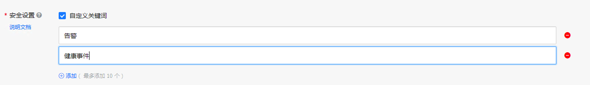

# DingTalk-Notifier 钉钉告警通知

我们在使用AWS时偶尔会在管理员邮箱中收到AWS关于EC2维护信息的通知邮件，这些邮件很容易淹没在收件箱中，没有得到及时处理。很多客户希望能够更及时收到这类消息，比如从微信或是钉钉等即时通信软件收到这类消息通知。

微信或钉钉等即时通信工具均提供了消息接口，第三方应用获取授权后，通过调用这些接口即可往客户端发送消息。在AWS上可以在EventBridge/Cloudwatch Event中配置事件规则，即可以触发一个Lambda运行微信/钉钉接口调用的处理逻辑。讲解这方面设计的博客和技术文章也比较多了，具体可以参考附录的一些链接。

这个项目会多做一点点，提供一个无须编写代码快速部署钉钉告警通知的功能。在Serverless Application Repository 中可以通过填入钉钉机器人接口相关的参数，即可快速部署整套钉钉告警通知的相关组件，涉及的 AWS 服务包括 EventBridge, SNS, Lambda 和 Secrets Manager 等。如下是整体的部署架构：

为方便演示，这个应用部署时创建了两个EventBridge的Rule，一个是捕获EC2的状态变化事件（如开关机），另一个是捕获EC2健康事件（如EC2计划维护事件）。因此部署后可以通过简单的启动或关闭EC2实例来检查是否可以在钉钉收到通知。

## 钉钉机器人创建与 Webhook URL

配置钉钉自定义机器人，请参考[官方说明](https://open.dingtalk.com/document/robots/custom-robot-access)

获取自定义机器人的 Webhook URL，作为部署的参数

**注意：** 推荐钉钉机器人安全设置选择“自定义关键词”，录入“告警”、“健康事件”作为默认关键词。需定制化情况下，用户可按需要，在 Event 或 Event rule 中添加关键词，并同时添加至钉钉机器人安全设置。

## 在 Serverless Application Repository 中部署此应用

可以在 SAR 中搜索 `DingTalk-notifier` 查到本应用（注意因为本项目会创建 EventBridge 到 SNS Publish 权限，所以按下图进行勾选。

部署应用时填入自定义机器人的整个 Webhook URL

LLM 相关部署选项

LLM 参数均为可选，默认值如上图所示。自定义 System Prompt 请参考 [defaultSystemPrompt](layer/python/claude.py) 进行定制。

## 提示效果

机器人提示效果如下：

## 通过 LLM 进行消息整理效果

原消息：

梳理完成消息：

## 默认包含的通知事件
* AWS Health Event
* AWS Health Abuse Event
* EC2 Instance State-change
* CloudWatch Alarm State Change

## 致谢

本项目基于 Niko Feng 企业微信对接[项目](https://github.com/nikosheng/wechat-lambda-layer-sam) 与 Randy Lin SAR部署[项目](https://github.com/linjungz/wechat-notifier.git) 的基础上修改钉钉对接实现及部署模板完成。在此对 Niko 与 Randy 表示感谢！

## 更新历史

2022-02-16:
钉钉机器人纯文本警告推送功能实现。

2022-02-20:
修改 Secrets Manager 中存储 security token 为存储整个 Webhook URL。

2022-10-16:
添加 AWS Cost Anomaly Detection 集成。

2022-11-2:
添加 Amazon GuardDuty 集成。

2023-02-28:
1. 转换 AWS 服务接入方式为插件模式，插件项目请参见[项目: AWS-Lambda-notifier-plugin](https://github.com/Chris-wa-He/AWS-Lambda-notifier-plugin)
2. 添加 Cloud Watch alarm state change 作为默认规则
3. 移除 AWS Cost Anomaly Detection & Amazon GuardDuty 集成，实现转移至[项目: AWS-Lambda-notifier-plugin](https://github.com/Chris-wa-He/AWS-Lambda-notifier-plugin)

2023-06-2:
添加 Event Bridge name 与 SNS ARN 作为输出，方便作为 plugin 集成参数输入。 

2023-06-14:
添加捕获 AWS Health Abuse Event 作为默认事件。

2024-05-16:
添加添加连接 Bedrock 托管 LLM 的能力，进行信息梳理。

## 附录

[AWS博客：基于AWS Serverless 一键启用微信/钉钉告警通知
](https://aws.amazon.com/cn/blogs/china/enable-wechat-dingtalk-alarm-notification-with-one-click-based-on-aws-serverless/)

[AWS博客：企业微信、钉钉接收 Amazon CloudWatch 告警
](https://aws.amazon.com/cn/blogs/china/enterprise-wechat-and-dingtalk-receiving-amazon-cloudwatch-alarms/)
